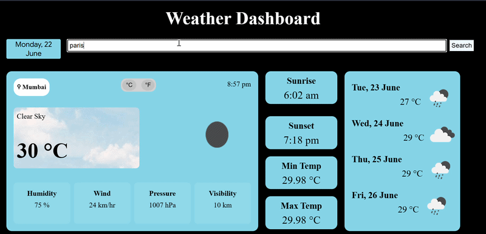

# Weather Dashboard 🌦️

A responsive weather dashboard built using HTML, CSS, and JavaScript that provides real-time weather updates and a 5-day forecast for any city using the OpenWeather API.

## Features

* Search weather by city name
* Real-time temperature, humidity, wind speed, and weather conditions
* 5-day weather forecast
* Celsius/Fahrenheit temperature toggle
* Responsive and user-friendly interface
* Error handling for invalid city searches

* Dark/Light mode toggle

## Preview

## Website Demo
https://khushinaik505.github.io/Weather-Dashboard/

Built as a frontend project to practice API integration, asynchronous JavaScript, and responsive web design.
